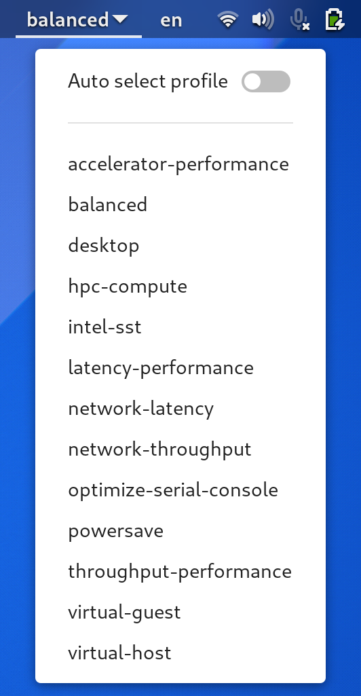

[//]: # (gnome-shell-extension-tuned-profile-switcher)
[//]: # (README.md)

# A gnome-shell-extension-tuned-profile-switcher documentation

*gnome-shell-extension-tuned-profile-switcher is a [GNOME Shell](https://wiki.gnome.org/Projects/GnomeShell) [TuneD](https://tuned-project.org/) profile switcher extension*

Contents
* [Installation](#installation)
* [Licensing](#licensing)
* [Contacts](#contacts)

## Installation

## Licensing
gnome-shell-extension-tuned-profile-switcher is free software: you can redistribute it and/or modify it under the terms of the GNU General Public License as published by the Free Software Foundation, either version 3 of the License, or (at your option) any later version.
For complete license text see COPYING file.

## Contacts
**Project Website**: https://github.com/vint21h/gnome-shell-extension-tuned-profile-switcher/

**Author**: Alexei Andrushievich <vint21h@vint21h.pp.ua>

For complete authors list see AUTHORS file.
